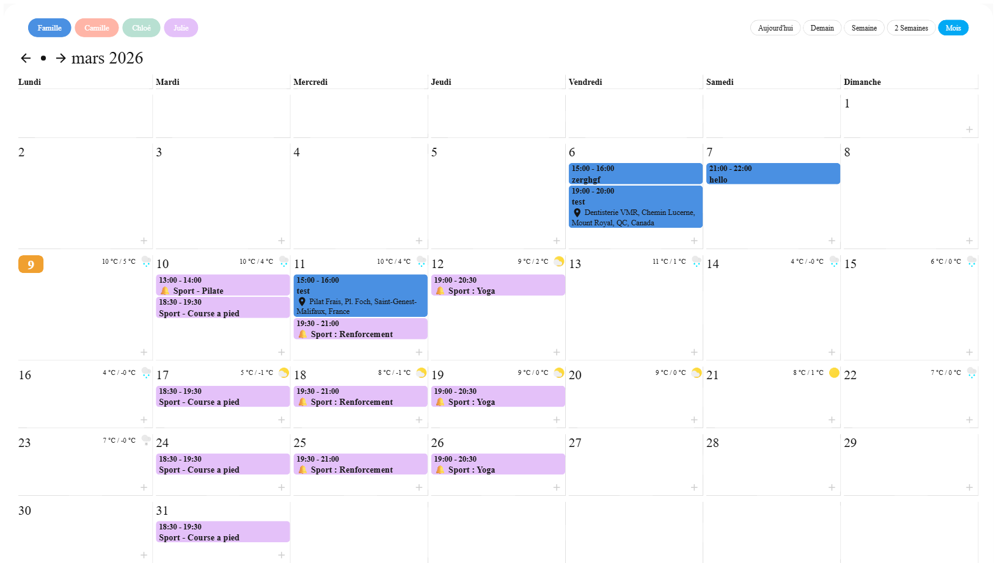

# Skylight Family Calendar Card

[](README.md) [](README.fr.md)



Une carte calendrier familial pour Home Assistant, inspiree de Skylight. Affiche les evenements de plusieurs calendriers avec une interface tactile, deux themes, integration meteo et gestion complete des evenements (creation, modification, suppression).

## Fonctionnalites

### Gestion des evenements
- **CRUD complet** : Creer, modifier et supprimer des evenements directement depuis la carte (aucun helper externe necessaire)
- **Saisie rapide** : ecrivez l'heure et l'objet d'un seul coup (ex. « 9h dentiste » ou « dentiste 9h ») — la carte les separe automatiquement. Sans heure ecrite, l'evenement est sur toute la journee. Ideal au stylet.
- **Saisie rapide IA** (optionnel) : si une entite `ai_task` est configuree dans Home Assistant, un bouton « Analyser avec l'IA » interprete une phrase libre (ex. « jeudi 20h cine avec les enfants ») en titre + heure + duree via votre LLM. Active automatiquement si une entite `ai_task` existe ; desactivable avec `aiQuickAdd: false` ou forcer l'entite avec `aiTaskEntity`.
- **✍️ Reconnaissance d'ecriture manuscrite** (optionnel) : avec une `geminiApiKey` **ou** `claudeApiKey`, la zone de saisie rapide devient une **zone de dessin** sur les tablettes tactiles — ecrivez l'evenement au stylet et l'IA (Google Gemini ou Anthropic Claude) lit votre ecriture et remplit titre + heure + duree. Sur ordinateur (souris) et smartphone, le formulaire reste 100% clavier.
- **Formulaires simples** : seuls titre, debut, duree (presets) et lieu sont affiches — le reste est dans un tiroir « Options avancees »
- **Evenements journee entiere** : creation et modification d'evenements sans horaire, y compris multi-jours
- **Recurrence** : Quotidienne, hebdomadaire, mensuelle, annuelle — avec intervalle, selection des jours et options de fin (dans le tiroir avance)
- **Marqueurs de notification** : Case a cocher dans les formulaires pour signaler un evenement pour les notifications vocales/telephone (detectable par les automations HA via `summary.startswith('🔔')`)
- **Google Places Autocomplete** pour le champ lieu (optionnel, necessite une cle API)

### Affichage du calendrier
- En-tete style Skylight avec date, heure et meteo actuelle
- Boutons de filtre calendrier (legende) pour afficher/masquer chaque calendrier
- Selecteur de vue : Aujourd'hui, Demain, Semaine, 2 Semaines, Mois
- Previsions meteo par jour + meteo actuelle dans l'en-tete (centree dans les cases)
- Detection automatique de l'entite meteo
- Navigation mois/semaine avec fleches
- En-tetes des jours (Lundi, Mardi...) au-dessus des colonnes
- Fond colore complet des evenements avec les couleurs du calendrier
- Mise en valeur du jour actuel (badge orange)
- Horaires en gras, lieu avec icone epingle
- **Evenements multi-jours fusionnes** : vacances et sejours affiches en bande coloree continue a travers les jours (style Google Agenda), option multiDayMode pour revenir a l'ancien rendu
- **Persistance de la vue** : la vue selectionnee est sauvegardee dans le localStorage et restauree au rechargement

### Double theme
- **Theme Skylight** : Look original inspire de Skylight avec ses couleurs et son style signature
- **Theme Home Assistant** : Look natif HA qui suit votre theme HA (mode sombre supporte)
- Selecteur de theme avec boutons icones dans l'en-tete de la carte

### Vue mois mobile
- Vue mois **style Google Agenda** sur petits ecrans (smartphones)
- Mini-grille calendrier avec **points colores** indiquant les evenements par jour
- **Appuyez sur un jour** pour afficher ses evenements dans un panneau sous la grille
- En-tetes des jours abreges (LUN, MAR, MER...) sur mobile
- Selection automatique du jour actuel en entrant dans la vue mois

### Navigation tactile et swipe
- **Glissez gauche/droite** pour naviguer entre les semaines ou les mois sur les appareils tactiles
- Fleches de navigation masquees automatiquement sur les appareils tactiles (smartphones, tablettes)
- Fonctionne sur smartphones, tablettes et appareils Windows tactiles

### Internationalisation et UX
- Support multilingue (en, fr, de, es, it, nl, pt) avec traduction automatique
- Mise en page responsive avec colonnes configurables
- Interface tactile (concue pour tablettes murales et smartphones)
- Mode compact
- Editeur de configuration GUI complet avec descriptions
- Compatible HACS

## Installation

### HACS (Recommande)

1. Ouvrir HACS dans votre Home Assistant
2. Aller dans Frontend
3. Cliquer sur le menu trois points et selectionner "Depots personnalises"
4. Ajouter `https://github.com/tienou/ha-skylight-family-calendar-card` avec la categorie "Lovelace"
5. Installer "Skylight Family Calendar Card"
6. Redemarrer Home Assistant

### Manuel

1. Telecharger `skylight-family-calendar-card.js` depuis la [derniere release](https://github.com/tienou/ha-skylight-family-calendar-card/releases)
2. Le copier dans `config/www/skylight-family-calendar-card.js`
3. Ajouter la ressource dans votre dashboard :

```yaml
resources:
  - url: /local/skylight-family-calendar-card.js
    type: module
```

## Configuration

### Exemple basique

```yaml
type: custom:skylight-family-calendar-card
title: Calendrier Familial
locale: fr
defaultView: Week
startingDay: monday
showHeader: true
weather:
  entity: weather.home
  showCondition: true
  showTemperature: true
  showLowTemperature: true
calendars:
  - entity: calendar.famille
    name: Famille
    color: "#4A90E2"
  - entity: calendar.travail
    name: Travail
    color: "#E27D4A"
```

### Options de configuration

| Option | Type | Defaut | Description |
|--------|------|--------|-------------|
| `title` | string | - | Titre de la carte affiche au-dessus du calendrier |
| `locale` | string | `en` | Langue (fr, de, es, it, nl, pt) |
| `defaultView` | string | `Week` | Vue par defaut (Today/Tomorrow/Week/Biweek/Month) |
| `startingDay` | string | `today` | Premier jour de la semaine (monday, today, etc.) |
| `showHeader` | boolean | `true` | Afficher l'en-tete date/heure/meteo |
| `showHeaderDate` | boolean | `true` | Afficher la date dans l'en-tete |
| `showHeaderClock` | boolean | `true` | Afficher l'horloge dans l'en-tete |
| `showTitle` | boolean | `true` | Afficher le titre de la carte |
| `showNavigation` | boolean | `true` | Afficher les fleches de navigation |
| `showWeekDayText` | boolean | `true` | Afficher les en-tetes des jours (Lun, Mar...) |
| `showCurrentWeather` | boolean | `false` | Afficher la meteo actuelle dans l'en-tete |
| `showWeather` | boolean | `true` | Afficher les previsions meteo par jour |
| `showTime` | boolean | `false` | Afficher l'heure de debut/fin des evenements |
| `showLocation` | boolean | `true` | Afficher le lieu dans la vue calendrier |
| `showLocationInForm` | boolean | `true` | Afficher le champ lieu dans les formulaires |
| `showDescription` | boolean | `false` | Afficher la description des evenements |
| `colorFullEvent` | boolean | `true` | Colorer tout le fond de l'evenement |
| `compact` | boolean | `true` | Mode d'affichage compact |
| `fillHeight` | boolean | `false` | Étire les rangées de jours pour occuper toute la hauteur de l'écran (idéal en vue panneau, ex. tablette murale) |
| `views` | list | toutes | Vues a afficher (ex. `Week,Month`) |
| `defaultCalendar` | string | - | Calendrier par defaut pour la creation d'evenements |
| `googleApiKey` | string | - | Cle API Google Places pour l'autocompletion du lieu |
| `weather` | object | - | Entite meteo et options d'affichage |
| `calendars` | list | requis | Entites calendrier a afficher |
| `hidePastEvents` | boolean | `false` | Masquer les evenements passes |
| `hideWeekend` | boolean | `false` | Masquer les week-ends |
| `combineSimilarEvents` | boolean | `false` | Combiner les evenements en double |
| `updateInterval` | number | `60` | Intervalle de rafraichissement en secondes |
| `multiDayMode` | string | `banner` | Multi-jours : `banner` (bande fusionnee), `default`, `multiple`, `single` |
| `slotStartHour` | number | `7` | Premiere heure du selecteur de creneaux |
| `slotEndHour` | number | `22` | Derniere heure du selecteur de creneaux |
| `aiQuickAdd` | boolean | auto | Bouton « Analyser avec l'IA » sur la saisie rapide (auto si une entite `ai_task` existe ; `false` pour desactiver) |
| `aiTaskEntity` | string | auto | Entite `ai_task.*` a utiliser (auto-detectee si non definie) |
| `geminiApiKey` | string | - | Cle API Google Gemini → active la zone de dessin manuscrite dans la saisie rapide |
| `geminiModel` | string | `gemini-2.5-flash` | Modele Gemini pour la reconnaissance d'ecriture |
| `claudeApiKey` | string | - | Cle API Anthropic Claude → active la zone de dessin via Claude Vision |
| `claudeModel` | string | `claude-opus-4-8` | Modele Claude pour la reconnaissance (ex. `claude-haiku-4-5` pour moins cher/rapide) |
| `aiProvider` | string | auto | Forcer le fournisseur : `gemini` ou `claude` (auto si une seule cle ; Claude prioritaire si les deux) |
| `theme` | string | `skylight` | Theme : `skylight` ou `homeassistant` |

### Options des calendriers

| Option | Type | Description |
|--------|------|-------------|
| `entity` | string | ID de l'entite calendrier (requis) |
| `name` | string | Nom d'affichage (utilise le friendly_name HA par defaut) |
| `color` | string | Couleur hex (pastel auto-assigne si non defini) |
| `icon` | string | Icone MDI |
| `filter` | string | Regex pour filtrer les evenements |

### Google Places Autocomplete

Pour activer l'autocompletion du lieu dans les formulaires, ajoutez une cle API Google Places :

```yaml
googleApiKey: VOTRE_CLE_API_GOOGLE
```

Prerequis :
1. Creer un projet dans la [Google Cloud Console](https://console.cloud.google.com/)
2. Activer **Places API (New)**
3. Creer une cle API dans Identifiants
4. Ajouter la cle dans la configuration de la carte

Sans cle API, le champ lieu fonctionne comme un simple champ texte.

### Marqueurs de notification

La carte inclut une case a cocher de notification dans les formulaires de creation/modification d'evenements. Lorsqu'elle est cochee, un prefixe `🔔` est ajoute au titre de l'evenement. Cela permet aux automations Home Assistant de detecter les evenements marques et de declencher des notifications vocales ou telephone.

Exemple d'automation :

```yaml
automation:
  - alias: "Notification vocale calendrier"
    trigger:
      - platform: calendar
        event: start
        offset: "-00:15:00"
        entity_id: calendar.famille
    condition:
      - condition: template
        value_template: "{{ trigger.calendar_event.summary.startswith('🔔') }}"
    action:
      - action: tts.speak
        target:
          entity_id: media_player.enceinte_salon
        data:
          message: "Rappel : {{ trigger.calendar_event.summary.replace('🔔 ', '') }} dans 15 minutes"
```

Voir [`examples/family_calendar.yaml`](examples/family_calendar.yaml) pour un exemple complet avec notifications vocales et telephone.

## Sécurité & vie privée

- **Les descriptions d'évènements sont affichées en texte brut** (pas en HTML). Cela empêche un évènement malveillant d'un calendrier partagé d'injecter du script dans le dashboard (XSS). Les retours à la ligne sont conservés.
- **Les clés API** (`geminiApiKey`, `claudeApiKey`, `googleApiKey`) sont stockées dans la config du dashboard et envoyées au fournisseur concerné. Sur un dashboard partagé, restreignez chaque clé à son API dans la console du fournisseur. Les clés sont envoyées dans les **en-têtes** de requête, pas dans l'URL.
- **La reconnaissance d'écriture** envoie l'image dessinée à Google Gemini ou Anthropic Claude pour analyse — uniquement si une clé est configurée et que vous lancez l'analyse.

## Localisation

La carte traduit automatiquement les textes de l'interface selon le parametre `locale`. Langues supportees : anglais, francais, allemand, espagnol, italien, neerlandais, portugais.

Vous pouvez surcharger n'importe quel texte dans la section `texts` de la configuration.

## Inspirations et credits

Ce projet s'appuie sur et est inspire de :

- **[FamousWolf/week-planner-card](https://github.com/FamousWolf/week-planner-card)** par Rudy Gnodde — le moteur de rendu calendrier de base
- **[mohesles/my-skylight-calendar](https://github.com/mohesles/my-skylight-calendar)** — le concept original de calendrier Skylight DIY
- **[Skylight](https://www.skylightframe.com/)** — le calendrier connecte commercial qui a inspire l'esthetique

## Licence

MIT License

Copyright (c) 2024 Rudy Gnodde (week-planner-card)
Copyright (c) 2024 mohesles (my-skylight-calendar)
Copyright (c) 2025-2026 Etienne Gaillard (ha-skylight-family-calendar-card)
