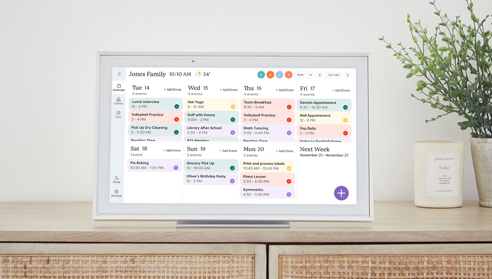

# Skylight Family Calendar Card



A Skylight-inspired family calendar card for Home Assistant. Displays events from multiple calendars with a beautiful touchscreen-friendly interface, weather integration, and full event management (create, edit, delete).

## Features

### Event Management
- **Full CRUD**: Create, edit, and delete events directly from the card (no external helpers needed)
- **Recurrence support**: Daily, weekly, monthly, yearly — with interval, day selection, and end options
- **🔔 Notification markers**: Checkbox in event forms to flag events for voice/phone notifications (detectable by HA automations via `summary.startswith('🔔')`)
- **Split date/time inputs**: Separate date and time fields for precise event scheduling
- **Google Places Autocomplete** for location field (optional, requires API key)

### Calendar Display
- Skylight-style header with date, time, and current weather
- Calendar filter buttons (legend) to show/hide individual calendars
- View selector: Today, Tomorrow, Week, 2 Weeks, Month
- Weather forecast per day + current weather in header
- Auto-detect weather entity
- Month/week navigation with arrows
- Day headers (Monday, Tuesday...) above columns
- Full-color event backgrounds with calendar colors
- Today highlighting (orange badge)
- Bold event times, location with pin icon
- Multi-day event display modes

### Internationalization & UX
- Multi-language support (en, fr, de, es, it, nl, pt) with auto-translation
- Responsive layout with configurable columns
- Touchscreen-friendly interface (designed for wall-mounted tablets)
- Compact mode
- Full GUI configuration editor with descriptions
- HACS compatible

## Installation

### HACS (Recommended)

1. Open HACS in your Home Assistant
2. Go to Frontend
3. Click the three dots menu and select "Custom repositories"
4. Add `https://github.com/tienou/ha-skylight-family-calendar-card` with category "Lovelace"
5. Install "Skylight Family Calendar Card"
6. Restart Home Assistant

### Manual

1. Download `skylight-family-calendar-card.js` from the [latest release](https://github.com/tienou/ha-skylight-family-calendar-card/releases)
2. Copy it to `config/www/skylight-family-calendar-card.js`
3. Add the resource in your dashboard:

```yaml
resources:
  - url: /local/skylight-family-calendar-card.js
    type: module
```

## Configuration

### Basic example

```yaml
type: custom:skylight-family-calendar-card
title: Family Calendar
locale: fr
defaultView: Week
startingDay: monday
showHeader: true
weather:
  entity: weather.home
  showCondition: true
  showTemperature: true
  showLowTemperature: true
calendars:
  - entity: calendar.family
    name: Family
    color: "#4A90E2"
  - entity: calendar.work
    name: Work
    color: "#E27D4A"
```

### Configuration options

| Option | Type | Default | Description |
|--------|------|---------|-------------|
| `title` | string | - | Card title displayed above the calendar |
| `locale` | string | `en` | Language locale (fr, de, es, it, nl, pt) |
| `defaultView` | string | `Week` | Default view (Today/Tomorrow/Week/Biweek/Month) |
| `startingDay` | string | `today` | First day of the week (monday, today, etc.) |
| `showHeader` | boolean | `true` | Show the date/time/weather header |
| `showHeaderDate` | boolean | `true` | Show date in header |
| `showHeaderClock` | boolean | `true` | Show clock in header |
| `showTitle` | boolean | `true` | Show card title |
| `showNavigation` | boolean | `true` | Show month/week navigation arrows |
| `showWeekDayText` | boolean | `true` | Show day headers (Mon, Tue...) |
| `showCurrentWeather` | boolean | `false` | Show current weather in header |
| `showWeather` | boolean | `true` | Show weather forecast per day |
| `showTime` | boolean | `false` | Show event start/end time |
| `showLocation` | boolean | `true` | Show event location in calendar view |
| `showLocationInForm` | boolean | `true` | Show location field in create/edit forms |
| `showDescription` | boolean | `false` | Show event description |
| `colorFullEvent` | boolean | `true` | Color full event background with calendar color |
| `compact` | boolean | `true` | Compact display mode |
| `views` | list | all | Which view buttons to show (e.g. `Week,Month`) |
| `defaultCalendar` | string | - | Default calendar entity for event creation |
| `googleApiKey` | string | - | Google Places API key for location autocomplete |
| `weather` | object | - | Weather entity and display options |
| `calendars` | list | required | Calendar entities to display |
| `hidePastEvents` | boolean | `false` | Hide past events |
| `hideWeekend` | boolean | `false` | Hide weekend days |
| `combineSimilarEvents` | boolean | `false` | Combine duplicate events |
| `updateInterval` | number | `60` | Auto-refresh interval in seconds |

### Calendar options

| Option | Type | Description |
|--------|------|-------------|
| `entity` | string | Calendar entity ID (required) |
| `name` | string | Display name (falls back to HA friendly_name) |
| `color` | string | Color hex (auto-assigned pastel if not set) |
| `icon` | string | MDI icon |
| `filter` | string | Regex to filter events |

### Google Places Autocomplete

To enable location autocomplete in event forms, add a Google Places API key:

```yaml
googleApiKey: YOUR_GOOGLE_API_KEY
```

Requirements:
1. Create a project in [Google Cloud Console](https://console.cloud.google.com/)
2. Enable **Places API (New)**
3. Create an API key in Credentials
4. Add the key to your card config

Without an API key, the location field works as a simple text input.

### 🔔 Notification Markers

The card includes a notification checkbox in event create/edit forms. When checked, a `🔔` prefix is added to the event title (summary). This allows Home Assistant automations to detect marked events and trigger voice or phone notifications.

Example automation trigger:

```yaml
automation:
  - alias: "Calendar Voice Notification"
    trigger:
      - platform: calendar
        event: start
        offset: "-00:15:00"
        entity_id: calendar.family
    condition:
      - condition: template
        value_template: "{{ trigger.calendar_event.summary.startswith('🔔') }}"
    action:
      - action: tts.speak
        target:
          entity_id: media_player.living_room_speaker
        data:
          message: "Reminder: {{ trigger.calendar_event.summary.replace('🔔 ', '') }} in 15 minutes"
```

See [`examples/family_calendar.yaml`](examples/family_calendar.yaml) for a complete example with both voice and phone notifications.

## Localization

The card auto-translates UI texts based on the `locale` setting. Supported languages: English, French, German, Spanish, Italian, Dutch, Portuguese.

You can override any text in the `texts` config section.

## Inspirations & Credits

This project builds upon and is inspired by:

- **[FamousWolf/week-planner-card](https://github.com/FamousWolf/week-planner-card)** by Rudy Gnodde -- the foundational calendar rendering engine
- **[mohesles/my-skylight-calendar](https://github.com/mohesles/my-skylight-calendar)** -- the original DIY Skylight calendar concept
- **[Skylight](https://www.skylightframe.com/)** -- commercial smart home calendar that inspired the aesthetic

## License

MIT License

Copyright (c) 2024 Rudy Gnodde (week-planner-card)
Copyright (c) 2024 mohesles (my-skylight-calendar)
Copyright (c) 2025 Etienne Gaillard (ha-skylight-family-calendar-card)
